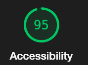

# LAB - 02 (class-02 and class-03)

## About me

I built an HTML website that incorporates an external CSS stylesheet and external JavaScript code. The purpose of the site is to share with the user different things about me, such as my bio, education, and goals. It prompts to user to ask their name so that it can customize messages welcoming them to the site and say goodbye. It also quizzes the user in five `Yes` or `No` questions about me.

Additional functionality was added to the site, including a `number guessing game` and a `multiple choice` question, which both had limits on the number of attempts. I also added a `counter` that tallies up the number of correct answers the user has throughout, which is used to  alert the user on how many questions they got correct. It does all of the things that it accomplishes well.

### Author: Rhett Chase

### Links and Resources

- [submission PR](https://github.com/rhettchase/code-201/tree/main/lab-02)
- [CSS Almanac](https://css-tricks.com/almanac/)
- [CSS Lists](https://www.w3schools.com/css/css_list.asp)
- [Skeleton CSS](http://getskeleton.com/#intro)

### Lighthouse Accessibility Report Score

### Reflections and Comments

- Using the `reset.css` file that stripped the default browser styling forced me to be more aware of styling options and dig into customizing the page
- I learned firsthand how specificity works in CSS when I was trying to find a bug for why an image wouldn't center, and it turned out it was getting direction from an element selector that conflicted with what I was trying to get it to do
- I learned how to use the Google Chrome `inspect` dev tools to debug my CSS when it was not appearing how I was expecting it to. The ability to drill down into what was being interpreted/loaded on the page and click them on/off to see how that impacted the other parts was super enlightening
- I used `for loops` to limit the number of attempts the user could answer, including a `break` statement to end the loop if the user answered correctly
- To include the **correct answer count** functionality, I learned how to create a counter variable and then `increment` this count for each time the user answered the question correctly
- I refactored all questions into functions and called them together in the flow that I wanted
- I converted the `multi-dimensional array` into separate single-dimension arrays to work from collections of like data: one for each of the questions and the correct answers
- JB was the Driver and I was the Navigator during the in-class pair programming demo, when we collaborated on refactoring the number guessing game code into a function
